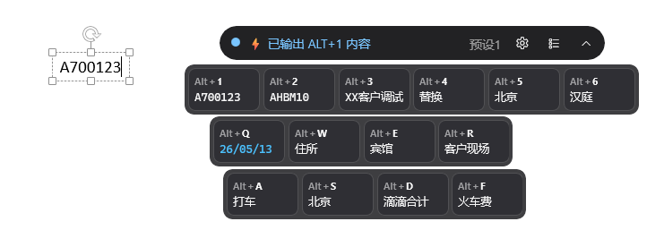
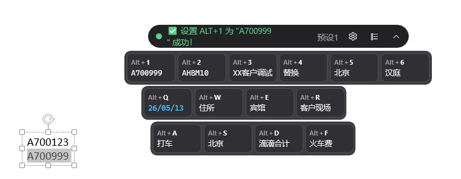
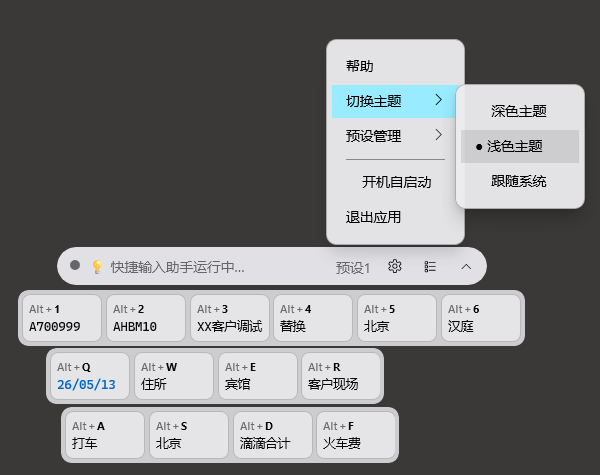
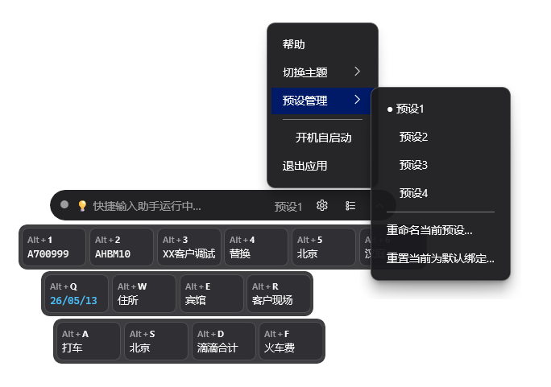
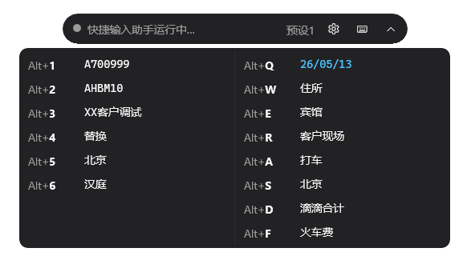

<p align="center">
  
</p>

<h1 align="center">QuickInputAssistant</h1>

<p align="center">
  A lightweight Windows floating-panel utility for fast reusable text input in forms, tickets, reports, and daily office workflows.
</p>

<p align="center">
  <strong>English</strong>
  &nbsp;·&nbsp;
  <a href="./README.md">简体中文</a>
</p>

<p align="center">
  
  
  
</p>

## Overview

QuickInputAssistant is a WinUI 3 floating-panel utility that lets you output frequently used text with global hotkeys. It is useful for repetitive form filling, ticket replies, reimbursement notes, approval comments, customer service templates, and other high-frequency text input scenarios.

## Features

- **14 global hotkeys** — `Alt+1~6` / `Alt+Q~R` / `Alt+A~F`; bind any text to each key and emit it instantly to the focused window
- **Smart date key `Alt+Q`** — single-click outputs today's date (YY/MM/DD); double-click undoes the previous output and emits +1 day
- **4 named presets** — switch between different binding sets with one click; each set is stored independently
- **Inline editing** — right-click a keycap → edit in place → any left-click confirms / any right-click cancels
- **3 themes** — Dark / Light / Follow system, suitable for different desktop backgrounds
- **Lightweight overlay** — always-on-top, transparent background, draggable, with 3 view modes: capsule / keyboard / list
- **Auto-start toggle** — one-click startup switch using HKCU registry, no admin permission required
- **Local-only & encrypted** — all bindings are stored locally and protected with DPAPI

## Use cases

- Repeated fixed-text input in ticketing systems
- Reimbursement, approval, after-sales, and service record templates
- Customer service, operations, and office shortcuts
- Quickly switching between multiple groups of reusable text
- Outputting template content into any Windows desktop application

## Screenshots

<div align="center">

<table width="90%">
  <tr>
    <td width="50%" align="center">
      
      <br>
      <sub>Input Mode</sub>
    </td>
    <td width="50%" align="center">
      
      <br>
      <sub>Copy Mode</sub>
    </td>
  </tr>
  <tr>
    <td width="50%" align="center">
      
      <br>
      <sub>Light Theme</sub>
    </td>
    <td width="50%" align="center">
      
      <br>
      <sub>Tray Menu</sub>
    </td>
  </tr>
  <tr>
    <td width="50%" align="center">
      
      <br>
      <sub>Capsule Mode</sub>
    </td>
    <td width="50%" align="center">
      
      <br>
      <sub>List Mode</sub>
    </td>
  </tr>
</table>

</div>

## Quick start

1. Go to [Releases](https://github.com/YoyoDavidGo/quick-input-assistant/releases) and download `QuickInputAssistant_Setup.exe`
2. Double-click to install
3. Launch the app, then press `Alt+1` in any application to output the bound text

## Build from source

```pwsh
.\build-release.cmd
```

Output: `dist\QuickInputAssistant_Setup.exe` (single-file installer, about 62 MB, includes .NET Runtime).

## Tech stack

- **WinUI 3** / Windows App SDK 1.5 (unpackaged, self-contained)
- **.NET 8**, x64
- **WinUIEx** (transparent backdrop)
- **H.NotifyIcon.WinUI** (tray)
- **Serilog** (logging)

## Requirements

Windows 10 19041+ / Windows 11, x64

---

<p align="center">
  <sub>Built with <a href="https://claude.com/claude-code">Claude Code</a></sub>
</p>
